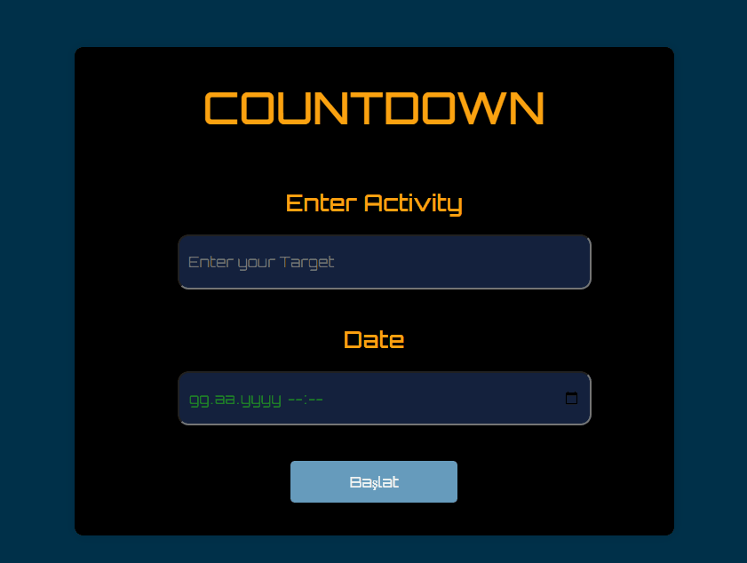

# ⏱️Left-Time Project

<a href="https://m-burak-yilmazer.github.io/Left-Time/
" ><Button style="color:blue, background-color:white; width:200px; padding: .5rem 2rem;">It's Lıve Here<Button></a>

The project I have made shows how much time you have until the date you have chosen. 

these are the screeshots of projects.

